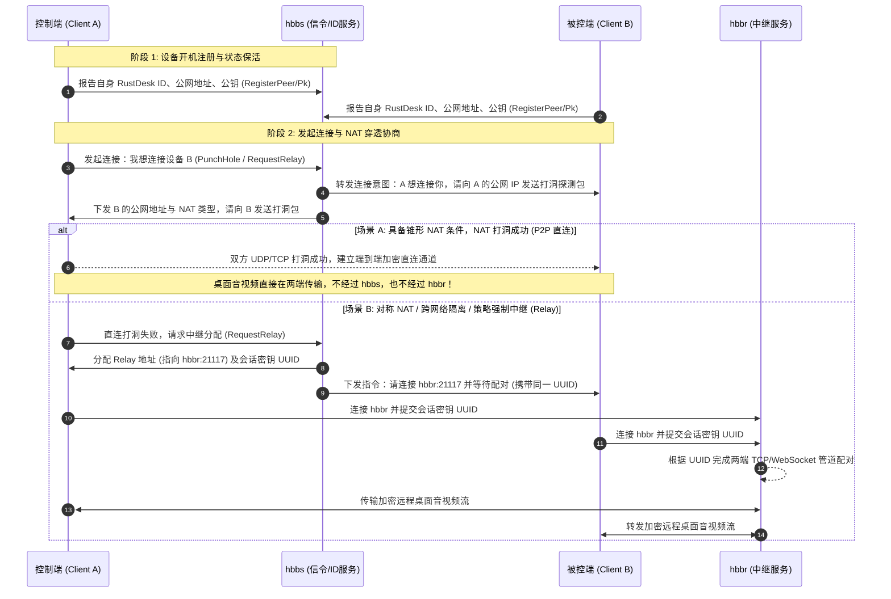

# RustDesk 通信层核心服务对比：hbbs vs hbbr

在 RustDesk 官方通信体系中，**`hbbs`** 与 **`hbbr`** 分别承担**“信令控制中枢”**与**“音视频数据中继”**两个截然不同的角色。

一句话概括二者的分工：  
**`hbbs` 负责牵线搭桥（设备注册、寻址、NAT 打洞与策略拦截），`hbbr` 负责在双方无法直连时充当通信管道（双向转发加密的桌面音视频流）。**

---

## 1. 核心职责与参数对比

| 维度 | **hbbs** (ID / Rendezvous Server) | **hbbr** (Relay Server) |
| :--- | :--- | :--- |
| **组件全称** | Honeybee Broker **Server** (ID/信令/交汇服务) | Honeybee Broker **Relay** (中继中转服务) |
| **体系分层** | **信令面（Signaling Plane）** | **数据面（Data Plane，仅中继场景）** |
| **源码入口** | `vendor/rustdesk-server/src/main.rs` | `vendor/rustdesk-server/src/hbbr.rs` |
| **核心模块** | `src/rendezvous_server.rs` | `src/relay_server.rs` |
| **默认监听端口** | **21115** (NAT 探测/管理端口), **21116** (TCP/UDP 信令主端口) | **21117** (TCP 中继数据主端口) |
| **传输承载内容** | 设备注册包、心跳保活、公钥与 IP 探测、打洞请求、中继协商指令（Protobuf 结构化微量数据） | 全量远程桌面视频流、音频流、键鼠指令、剪贴板数据与文件传输（加密流式数据） |
| **带宽与资源消耗** | **极低带宽**（几十 KB/s ~ 数 MB/s 即可支撑大量设备），主要消耗网络并发连接数与 CPU | **高吞吐带宽**（每路活跃会话消耗 1~5 Mbps 出口带宽），主要消耗网络带宽吞吐与网卡 I/O |
| **数据流是否必经** | **所有客户端必须始终连接**，保持在线心跳与信令监听 | **按需接入**；若双方 P2P 打洞成功，**完全不经过 hbbr** |

---

## 2. 典型连接建立时序与协作机制

客户端之间建立远程桌面会话时，`hbbs` 与 `hbbr` 的交互与数据流向如下图所示：



---

## 3. 在本控制面项目中的定制策略切面

在本项目（`rustdesk-control-plane`）中，为了在**不修改官方客户端**的前提下实现企业级准入与合规审计，分别针对 `hbbs` 与 `hbbr` 注入了特定的控制钩子：

### 3.1 `hbbs` 端的控制切面 (`src/rendezvous_server.rs`)
1. **设备注册准入拦截 (`RegisterPeer` / `RegisterPk`)**：
   - 客户端上线向 `hbbs` 注册时，`hbbs` 调用管理后台 `/api/policy/check`；
   - 未审批设备（`pending`）或已被管理员禁用的设备（`disabled`/`rejected`），立即拒绝注册；
   - 登记事件异步上报至控制面 `communication_events` 表。
2. **连接意图校验 (`PunchHole` / `RequestRelay`)**：
   - 控制端发起连接请求时，`hbbs` 校验目标设备是否允许被访问；
   - 校验链路：目标设备是否已审批 $\rightarrow$ 目标设备负责人是否停用 $\rightarrow$ 负责人所属部门是否停用；任一环节停用立即拦截。
3. **强制中继判定 (`force_relay`)**：
   - 若后台为某类高密设备配置了 `force_relay` 策略，`hbbs` 会故意向客户端标记 NAT 对称冲突，强制两端放弃 P2P 直连，转入 `hbbr`。

### 3.2 `hbbr` 端的控制切面 (`src/relay_server.rs`)
1. **中继建立前二次准入**：
   - 在两端接入 `hbbr` 管道配对前，调用策略引擎再次确认该会话是否被允许。
2. **精确会话生命周期审计**：
   - 配对成功时向控制面上报 `relay_start` 事件（记录 UUID、两端 IP、时间）；
   - 会话结束或异常中断时上报 `relay_end` 事件；控制面据此在 `sessions` 表中维护精确的会话台账。
3. **活跃会话强制拆断 (`disconnect`)**：
   - 管理员在后台界面点击“断开会话”时，控制面连接 `hbbr` 本地回环控制台端口，发送 `disconnect <sessionKey>` 指令，强制拆除对应的 TCP/WebSocket 管道。

---

## 4. 架构边界与安全注意事项

1. **直连会话不可由后台强制拆断**：
   - 由于 P2P 直连场景下，流量直接在两端客户端间点对点流动，**完全不经过 `hbbr`**；因此管理后台无法通过 `hbbr` 中断已建立的直连会话，也无法精确捕获直连会话的结束时间点。
2. **单向目标控制 vs 双向源端 ACL**：
   - 官方 RustDesk 客户端协议在握手阶段未可靠携带防伪的发起端 ID；
   - 因此目前策略鉴权强制执行的是**“目标设备级控制”**（控制谁能被连接），而非“发起端 A 到目标端 B”的端到端 ACL。

---

## 5. 生产网络规划建议

```text
[公网 / 客户端]
      │
      ├── (TCP/UDP 21116) ──────────> [ hbbs ] (信令中转，建议放置于内网/DMZ，仅暴露所需端口)
      │                                   │
      ├── (TCP 21117) ──────────────> [ hbbr ] (中继中转，需配置大带宽，建议靠近骨干网)
      │                                   │
[管理内网]                                 │ (HTTP Policy API: /api/policy/check)
      └── (HTTPS 3000) ──────────────> [ 控制面 Node.js ] <───> [ PostgreSQL 16 ]
```

- **带宽规划**：`hbbs` 仅需 2~5 Mbps 保证信令毫秒级响应；`hbbr` 必须根据并发中继路数规划带宽（建议预留 `并发数 × 3 Mbps` 的出向公网带宽）。
- **高可用与扩展**：
  - `hbbs` 负责维护设备实时状态，通常采用主备单实例或结合共享持久化；
  - `hbbr` 是无状态的管道中继节点，可以通过配置多个不同机房的 Relay 地址实现横向弹性扩容。
