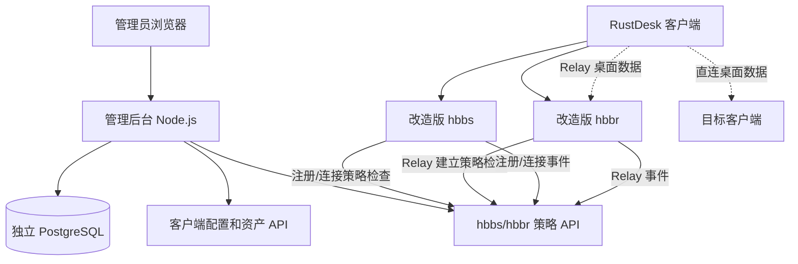

# RustDesk Control Plane 服务端增强方案

## 1. 文档目的

本文档记录当前 RustDesk 管理后台和服务端增强方案，作为后续开发、评审、部署和版本同步的技术基线。

目标是：**不修改 RustDesk 客户端，在管理后台提供控制面，并通过改造版 `hbbs/hbbr` 对可验证的设备策略进行服务端执行。**

本文档不把 Headscale/Tailscale 的能力直接等同于 RustDesk 能力。RustDesk 的客户端身份和连接路径不同，所有能力声明必须以当前协议实际字段和互操作测试为准。

## 2. 状态说明

- `已实现`：当前仓库已有代码或测试覆盖。
- `部分实现`：已有代码骨架，但缺少生产验证、认证、持久化或完整边界处理。
- `待实现`：设计阶段，当前没有可用实现。

## 3. 目标和非目标

### 3.1 目标

- 管理用户、部门、角色、权限、设备和设备分组。
- 管理设备负责人、Relay 和客户端配置。
- 使用独立 PostgreSQL 保存控制面数据。
- 保留 RustDesk 官方通信模型：`hbbs` 负责注册、发现、信令，`hbbr` 负责 Relay。
- 在不重新编译客户端的前提下，由改造版 `hbbs/hbbr` 执行设备级注册和连接策略。
- 记录管理操作、策略判定、注册事件和 Relay 事件。

### 3.2 非目标

- 不把管理后台作为远程桌面数据转发节点。
- 不直接读取或依赖 `hbbs` 内部 SQLite 作为管理数据库。
- 不在第一阶段实现 Pro Web 控制台、OIDC、LDAP 的完整替代品。
- 不声称在不修改客户端时实现 Tailscale 级别的强设备身份。
- 不声称 `hbbr` 可以断开已经建立的直连会话。

## 4. 总体架构



### 4.1 控制面

组件：`admin/server.js`、`admin/store.js`、`admin/auth.js`、`admin/migrations/`、管理台静态页面。

职责：

- 资产和组织数据管理。
- 客户端配置生成。
- 策略判定和策略事件接收。
- 审计、统计和运维操作。
- `hbbs/hbbr` 子进程生命周期管理。

当前状态：**已实现本地管理员认证、角色授权和版本化迁移；OIDC、高可用会话和真实 PostgreSQL 集成验证仍待完成。**

### 4.2 通信面

组件：`vendor/rustdesk-server` 中的 `hbbs` 和 `hbbr`。

职责：

- 继续执行 RustDesk 官方注册、发现、NAT 穿透和 Relay 协议。
- 在关键入口调用控制面策略 API。
- 将通信事件异步上报控制面。

当前状态：**已接入可选策略回调；Rust 编译和真实客户端互操作尚未验证。**

### 4.3 数据面

- 直连场景：客户端之间直接传输远程桌面数据，不经过管理后台，也不经过 `hbbr`。
- Relay 场景：客户端通过 `hbbr` 传输数据。
- 管理后台只保存元数据、状态、策略和审计，不转发桌面数据。

## 5. 当前已实现能力

### 5.1 管理后台

已实现：

- `hbbs/hbbr` 启动、停止、重启和状态展示。
- runtime console 代理。
- 独立 PostgreSQL schema 定义。
- 内存存储 fallback，仅用于开发和测试。
- 部门、角色、用户、设备组、Relay、设备、会话、审计模型的初版。
- 设备登记、禁用/启用、分组和负责人字段。
- 设备心跳接口和两分钟在线窗口计算。
- 客户端 ID Server、Relay Server、公钥配置生成。
- 管理台设备资产展示和登记操作。

部分实现：

- 数据模型已有角色和权限字段，但没有管理后台身份认证和权限中间件。
- `sessions` 表已定义，但连接事件尚未完整写入会话生命周期。
- 设备 heartbeat 接口存在，但原生未修改客户端不会主动调用它。

### 5.2 服务端策略回调

已实现：

- `hbbs` 注册路径策略：`RegisterPeer`、`RegisterPk`。
- `hbbs` Punch Hole 连接策略。
- `hbbs` Request Relay 连接策略。
- `hbbr` Relay 建立前策略。
- 设备注册、连接请求、Relay 开始和结束事件上报。
- Bearer Token。
- 可选 fail-open/fail-closed。

当前策略实际主要依据：

- `targetId` / 目标 RustDesk ID。
- `action`：`register`、`connect`、`relay`。
- `sourceIp`：仅作为事件和策略输入，不能等同于可信源设备身份。
- `device-owner-department-v1`：目标设备须 `approved` 且未禁用；已绑定负责人时负责人须启用；负责人已绑定部门时部门须启用。

拒绝响应包含 `policyVersion` 和稳定的 `reason`，同时写入审计日志。当前原因包括 `device_unknown`、`device_pending`、`device_rejected`、`device_disabled`、`owner_disabled` 和 `department_disabled`。

## 6. 能力边界和安全假设

### 6.1 可以可靠实现的能力

- 设备是否登记。
- 设备是否批准、禁用或拒绝。
- 目标设备是否允许新的注册或连接请求。
- Relay 建立前是否允许进入 `hbbr`。
- 设备级在线事件和 Relay 事件记录。
- 全局强制 Relay 或基础 Relay 选择策略。

### 6.2 当前不能可靠实现的能力

- 完整的“源设备 A -> 目标设备 B”ACL。
- 不修改客户端时的强源端设备身份认证。
- 通过 `hbbr` 断开已经建立的直连会话。
- 仅依靠管理后台页面阻止客户端绕过后台。
- 防止用户将客户端改回其他 ID Server 或手工修改配置。

### 6.3 安全假设

- 所有受管客户端应通过配置使用指定 ID Server、Relay Server 和公钥。
- 管理后台只在内网、loopback 或经过认证的反向代理后暴露。
- `CONTROL_PLANE_TOKEN` 只注入服务进程，不写入仓库。
- 启用 fail-closed 前必须先完成控制面高可用、超时和故障演练。
- 公钥可以下发；私钥只保留在服务运行目录并设置最小文件权限。

## 7. 数据模型

当前 PostgreSQL 迁移位于 `admin/migrations/`；已应用版本由 `schema_migrations` 表记录。`admin/schema.sql` 只保留为早期结构参考。

### 7.1 组织和权限

```text
departments
roles
managed_users
```

关系：

- 用户可关联部门。
- 用户可关联角色。
- 角色保存权限集合。
- 后续管理员认证主体应关联 `managed_users`，审计日志记录用户 ID，而不是固定字符串。

### 7.2 设备和通信资源

```text
device_groups
relays
devices
```

设备关键字段：

- `rustdesk_id`：客户端对外 RustDesk ID，唯一。
- `owner_id`：设备负责人。
- `group_id`：设备分组。
- `relay_id`：指定 Relay。
- `disabled`：是否禁止新的策略动作。
- `last_seen_at`：最后事件时间。
- `metadata`：平台、主机名和扩展元数据。

### 7.3 会话和审计

```text
sessions
audit_logs
```

后续应将通信事件和管理员操作分开：

- `sessions`：连接生命周期、双方标识、Relay 地址、开始/结束时间。
- `audit_logs`：谁在什么时候对什么资源执行了什么操作，以及策略详情。

## 8. API 方案

### 8.1 管理 API

当前已有：

```text
GET/POST  /api/admin/departments
GET/POST  /api/admin/roles
GET/POST  /api/admin/users
GET/POST  /api/admin/groups
GET/POST  /api/admin/relays
GET/POST  /api/admin/devices
PATCH     /api/admin/devices/:id
GET       /api/admin/sessions
GET       /api/admin/audit
GET       /api/admin/summary
POST      /api/devices/:id/heartbeat
GET       /api/devices/:id/config
```

注意：当前管理 API 仍缺少正式认证，不应直接暴露公网。

### 8.2 服务端策略 API

服务端策略请求：

```http
POST /api/policy/check
Authorization: Bearer <CONTROL_PLANE_TOKEN>
Content-Type: application/json
```

```json
{
  "targetId": "123456789",
  "action": "connect",
  "sourceIp": "198.51.100.10"
}
```

控制面响应：

```json
{
  "allowed": true
}
```

事件上报：

```http
POST /api/policy/events
Authorization: Bearer <CONTROL_PLANE_TOKEN>
Content-Type: application/json
```

```json
{
  "eventId": "relay-uuid:relay_start",
  "eventType": "relay_start",
  "targetId": "123456789",
  "sessionKey": "relay-uuid",
  "sourceIp": "198.51.100.10",
  "details": { "relayAddress": "relay.example.com:21117" }
}
```

后续应增加：

- Relay 双方可识别身份、传输统计和关闭原因。
- `policyVersion` 和命中规则。
- 明确的拒绝码和用户可见错误文案。
- 策略缓存和事件队列。

当前新增的目标策略规则按优先级匹配设备、设备组和标签，效果为 allow、deny 或 force relay。设备状态、负责人状态和部门状态是不可绕过的前置条件。force relay 决策由改造版 `hbbs` 转换为对称 NAT 协商；该逻辑仍需要 Rust 构建和客户端互操作验证。

## 9. 服务端调用流程

### 9.1 设备注册

```text
客户端 -> hbbs: RegisterPeer / RegisterPk
hbbs -> 管理后台: action=register
管理后台 -> PostgreSQL: 查询设备状态
管理后台 -> hbbs: allowed=true/false
hbbs -> 客户端: 官方注册响应或拒绝响应
hbbs -> 管理后台: device_register 事件
```

当前行为：未知设备默认创建为 `pending`，允许完成注册但不允许新的连接或 Relay；管理员批准后变为 `approved`。可使用 `UNKNOWN_DEVICE_POLICY=deny|pending|allow` 调整，生产建议使用默认 pending 或更严格的 deny；allow 仅用于联调。

### 9.2 连接请求

```text
客户端 -> hbbs: PunchHoleRequest / RequestRelay
hbbs -> 管理后台: action=connect
管理后台 -> PostgreSQL: 查询目标设备
管理后台 -> hbbs: allowed=true/false
hbbs -> 客户端: 官方协商响应或拒绝原因
```

### 9.3 Relay 建立

```text
客户端 -> hbbr: RequestRelay
hbbr -> 管理后台: action=relay
管理后台 -> hbbr: allowed=true/false
hbbr -> 客户端: 建立或拒绝 Relay
hbbr -> 管理后台: relay_start / relay_end (eventId, sessionKey)
```

管理后台将所有事件写入幂等的 `communication_events`；只对包含稳定 `sessionKey` 的 Relay 事件更新 `sessions`。直连协商缺少可靠结束信号，因此目前只保存连接请求事件。

## 10. 配置和部署

关键配置：

```bash
DATABASE_URL=postgresql://user:password@db:5432/rustdesk_control
ID_SERVER_ADDRESS=rd.example.com:21116
RELAY_ADDRESS=rd.example.com:21117
RUSTDESK_PUBLIC_KEY=<id_ed25519.pub 内容>
CONTROL_PLANE_URL=http://127.0.0.1:3000
CONTROL_PLANE_TOKEN=<secret>
CONTROL_PLANE_ENFORCE=Y
```

部署原则：

1. PostgreSQL 与通信服务分离部署。
2. `data/` 持久化，保存官方服务运行数据库、密钥和日志。
3. 管理后台只监听内网或 loopback。
4. `hbbs/hbbr` 使用本仓库 fork 构建的二进制。
5. 客户端继续使用标准 RustDesk 客户端配置。
6. 先使用 fail-open 进行联调，验证稳定后再切换 fail-closed。

## 11. 可观测性和故障策略

### 11.1 策略 API 超时

- 默认服务端请求超时约 800ms。
- 未启用控制面：直接允许，保持官方行为。
- 启用控制面且 fail-open：记录警告并允许。
- 启用控制面且 fail-closed：记录警告并拒绝。

改造版服务端已实现短 TTL 策略缓存、连续三次失败后的熔断和三次事件重试；这些修改尚未在 Rust 工具链和真实客户端中验证。缓存按目标 ID 与动作键控，使用低 TTL 作为策略更新收敛机制；即时失效需后续增加控制面推送，持久化队列/死信队列仍待实现。

### 11.1.1 控制面指标与保护

控制面提供 `/healthz` 和受管理员授权保护的 `/metrics`。当前指标包括策略判定耗时与结果、事件持久化、限流和活跃 Relay 会话。登录和策略 API 按来源固定窗口限流；需要在反向代理层配合 WAF、IP 限制和 TLS，进程内限流不能替代边界防护。

响应使用 `nosniff`、拒绝嵌入、禁止 Referer 和同源 CSP。控制面日志脱敏常见 Bearer Token、密码和 PostgreSQL URL 密码；私钥不写入日志或 API。

### 11.2 管理后台不可用

生产建议：

- 控制面至少两个实例或由可靠反向代理提供高可用。
- PostgreSQL 使用备份和恢复演练。
- fail-closed 模式必须有应急切换方式。
- 应急操作不能通过任意 shell，使用受限配置或安全开关。

### 11.3 当前实施路线

当前开发不执行 Rust 构建和运行验证，因此服务端策略缓存、熔断、事件重试、force relay 和 Relay 强制断开代码均视为“待运行时验证”，不视为生产可用功能。

1. 补全 Relay 双方身份、传输统计和可观察的直连事件边界。
2. 在独立 PostgreSQL 环境验证 migration、JSONB、并发 CRUD、重启恢复和数据保留策略。
3. 在具备 Rust 工具链的环境恢复 `hbbs/hbbr` 编译、启动、官方客户端互操作及 fail-open/fail-closed 验证。

## 12. 版本和上游同步

`vendor/rustdesk-server` 是官方服务端 fork/快照，后续同步上游时必须：

1. 记录上游版本和提交号。
2. 检查 `rendezvous_server.rs` 的注册、Punch Hole、Request Relay 路径是否变化。
3. 检查 `relay_server.rs` 的握手和配对逻辑是否变化。
4. 重新应用或重做 `policy.rs` 接入点。
5. 执行 Rust 编译、Node 测试和官方客户端互操作测试。
6. 检查 AGPL-3.0 义务和新增代码许可证说明。

## 13. 发布前检查

- [x] 实现已包含本地管理员认证、角色授权和 CSRF 保护；部署时仍必须设置 `ADMIN_PASSWORD`。
- [ ] `DATABASE_URL` 指向 PostgreSQL，未使用内存存储。
- [ ] `CONTROL_PLANE_TOKEN` 已通过 Secret 注入。
- [ ] `id_ed25519` 和 `id_ed25519.pub` 已持久化且权限正确。
- [ ] `hbbs/hbbr` 构建版本与策略 API 契约一致。
- [ ] fail-open/fail-closed 行为已测试。
- [ ] 禁用设备无法建立新的连接或 Relay。
- [ ] 直连和 Relay 两种路径都已验证。
- [ ] 审计和事件数据可查询。
- [ ] 已完成备份、恢复和应急切换演练。
- [ ] 对外文档没有超出协议实际能力的 ACL 承诺。
- [ ] 已配置 HTTPS 反向代理或仅绑定 loopback/private network。
- [ ] `/healthz` 和受保护的 `/metrics` 已接入监控与告警。
- [ ] 已按照 `docs/OPERATIONS-RUNBOOK.md` 完成 PostgreSQL 恢复和密钥轮换演练。
